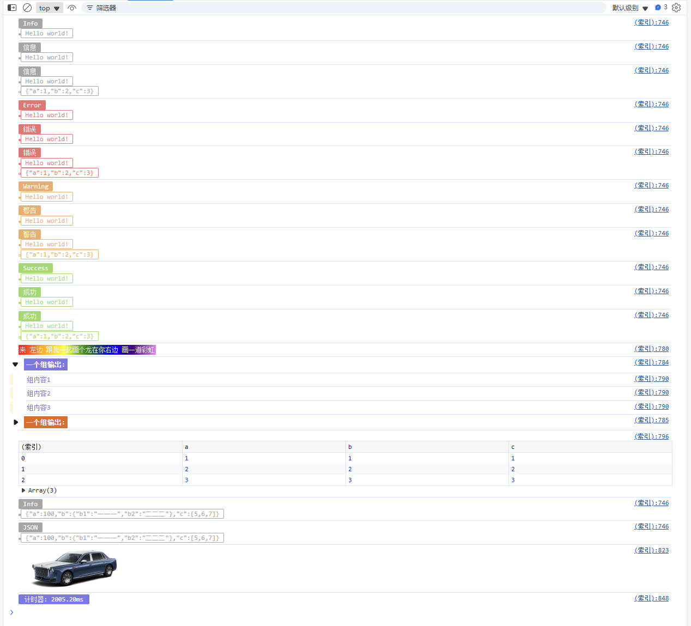

<div align="center">
<h1>Pretty-Log</h1>
<h2>美化log</h2>
</div>

## 安装
```sh
  npm install @wb04307201/pretty-log -g
```

## 使用
```javascript
    import {prettyLog} from './src/main.ts';

    prettyLog.info("Hello world!")
    prettyLog.info("信息", "Hello world!")

    prettyLog.error("Hello world!")
    prettyLog.error("错误", "Hello world!")

    prettyLog.warning("Hello world!")
    prettyLog.warning("警告", "Hello world!")

    prettyLog.success("Hello world!")
    prettyLog.success("成功", "Hello world!")

    prettyLog.rainbow("来 左边 跟我一起画个龙在你右边 画一道彩虹")

    prettyLog.group("一个组输出", ["组内容1", "组内容2", "组内容3"])

    prettyLog.table([{a: 1, b: 1, c: 1}, {a: 2, b: 2, c: 2}, {a: 3, b: 3, c: 3}])

    prettyLog.picture("https://faw-cms-1300211780.cos.ap-beijing.myqcloud.com/202405/51716773469593/1716773469593%E8%BD%A6%E5%9E%8B%E5%9B%BE4_1000x400.png", 0.2)
```
## 输出
